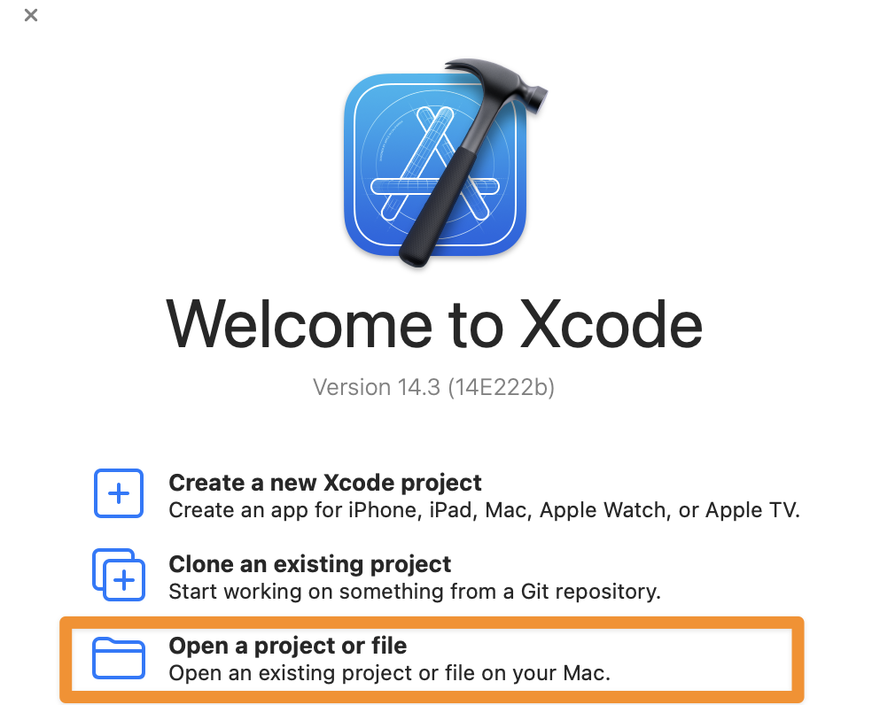
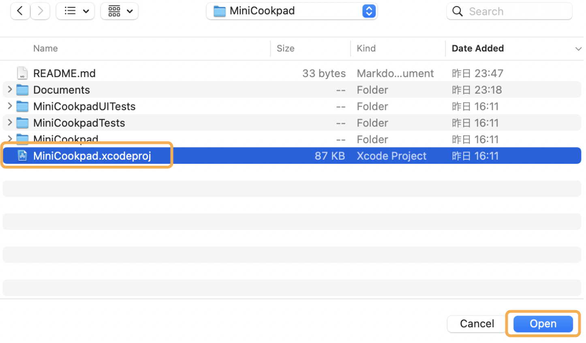
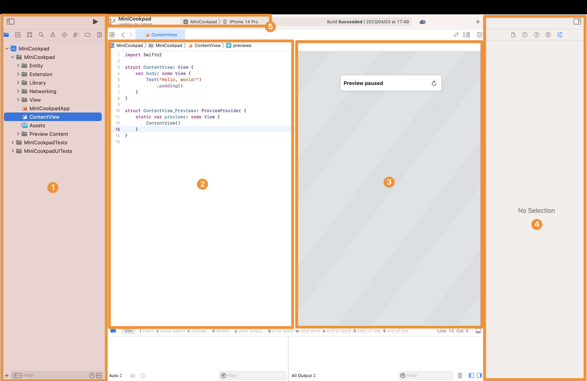
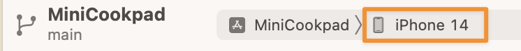
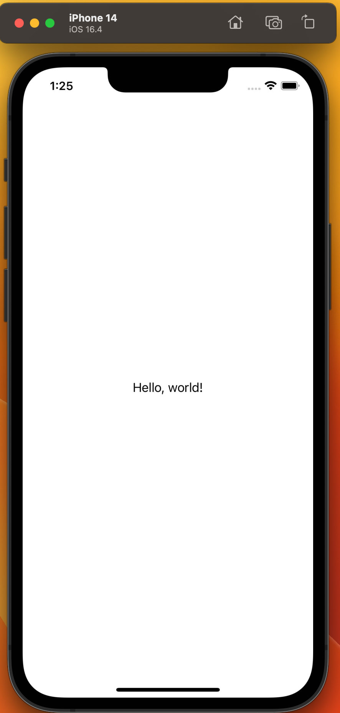

# iOS アプリ開発をはじめよう

まずは、Xcode で

- ソースコードをビルドし、シミュレータで iOS アプリを動かすところ

までをやってみましょう。

## Fork と Clone

このリポジトリを Fork して Clone してください。
作業中の質問に回答する際など、出来ているところまで push してもらう可能性があります。

## プロジェクトを開く

Xcode.app を開きます。

「Open a project or file」を選択してください

Fork したプロジェクトのあるフォルダを開いて、MiniCookpad.xcodeproj を選択し、open をクリックします。

## Xcode の簡単な説明

プロジェクトを開くと、Xcode の画面が開きます。

まず、左のペインから`ContentView.swift`を選択してください。

ソースコードが開くと次のような画面が開きます。

簡単にそれぞれ説明していきます。

### 1. ナビゲーションエリア

- ファイルツリーの表示、ツリーからファイルを選択してエディタエリアで開く、プロジェクト内検索（`⌘⇧F`）といった機能があります

### 2. エディタエリア

- ソースコードを記述する場所

### 3. キャンバス

- Xcode Previews が表示される場所

### 4. インスペクタエリア

- 主にファイルの情報が表示されたり、SwiftUI 等を編集しているときの UI パーツのパラメータ調整をする場所

### 5. 実行、停止、アプリケーションの選択、実行対象の選択

- ここで実行するアプリケーション、シミュレータを選んで実行、停止ができる。

### 💡 便利なショートカット

[ショートカットリスト](https://github.com/cookpad/cookpad-internship-2019-summer/blob/master/ios/docs/shortcuts.md)に開発をする上で便利なショートカットを載せておくので、Chrome の別タブで開いて必要に応じて見てみてください。
また、講義資料内では、対応する動作にショートカットがある場合は、(`ショートカットキー`)という表記を付けておきます。

#### 記号

- ⌘: コマンドキー(cmd)
- ⇧: シフトキー(shift)
- ⌃: コントロールキー(ctrl)
- ⌥: オプションキー(opt/alt)

## デバッグ実行をする

ではまずは「デバッグ実行」をしてシミュレータを起動します。
画面左上のエリアから実行対象として、適当な iPhone のシミュレータを選択してください。

(この画像では iPhone 14 のシミュレータを実行対象にしています)

選択ができたら「▷」ボタンを押し実行しましょう。（`⌘R`でも可能です）
「Hello, world!」という文字がシミュレータの画面中心に表示されていれば成功です！

＊単純にビルドを行いソースコードが正しくコンパイルできるかを実行する場合は、（`⌘B`）でビルドのみを行うことができます。

---

[Chapter2 へ進む](chapter_02.md)
