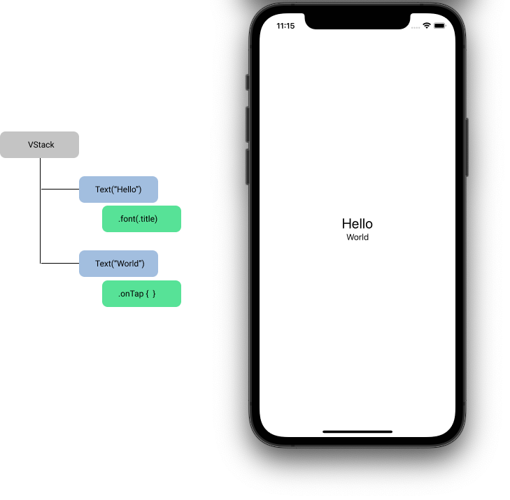

# レシピ一覧画面を作ろう part1

この章では、レシピ一覧画面でリスト表示するレシピの View を作って Xcode Previews 上で表示することを目指します。
完成すると Xcode Previews で以下の画像のようになります。


この章では、レシピの View の作成を通して

- 画像、テキストを表示する方法
- 複数の要素を縦(or 横)方向に並べる方法
- ViewModifier を使ってレイアウトを調整する方法

を学んでいきます。

## 講義: SwiftUI App の概要

ハンズオンに入る前に、SwiftUI の View の概要を説明します。

### SwiftUI App のエントリーポイント

SwiftUI App は`@main`という属性のついた、`App`プロトコルに準拠した構造体をエントリーポイントとして処理が開始されます。
`MiniCookpad`では`MiniCookpadApp.swift`というファイルに含まれる`struct MiniCookpadApp`がそれにあたります。

```swift
import SwiftUI

@main
struct MiniCookpadApp: App {
    var body: some Scene {
        WindowGroup {
            ContentView()
        }
    }
}
```

`body`プロパティの`WindowGroup`配下に書かれている`ContentView`がアプリの起動時に表示される View です。この`ContentView`を別の View にすれば起動時に表示される View を変えることもできます。

ここに登場している、`App`, `WindowGroup`というのは SwiftUI のアプリを構成する概念を実装に落とし込んだものですが、iOS アプリでは意識する必要がないため、割愛します。
興味がある方は[App essentials in SwiftUI](https://developer.apple.com/videos/play/wwdc2020/10037/)を見てみてください。

## SwiftUI View の基本

次に View の基本的な考え方を説明します。



SwiftUI では基本の`View`として`Text`, `Button`, `Image`のような表示要素や、`VStack`, `HStack`などのレイアウトを行う要素を提供しています。

また、View は`ViewModifier`という機能でカスタマイズをすることができます。

`ViewModifier`には View の周りに隙間をあける`.padding`や描画するフォントを変える`.font`等の表示に関わるものや、`onTapGesture`や`onAppear`など View のイベントに関わるものがあります。

これらの基本的な`View`と`ViewModifier`を組み合わせて、アプリケーションのビューを組んでいきます。

例えば図の例では、`Hello`と`World`という 2 つの文字列を`Text`という View で表示しています。
`Hello`を表示している`Text`のフォントを`.font`という Modifier を使って変えています。
この 2 つの View を`VStack`という自身の子を縦に並べる View を使って並べています。

### View の実装と Xcode Previews

次に View の実装ファイルと、Xcode Previews の説明をします。

`ContentView.swift`を開き、`キャンバスエリア`にある「Preview paused の右に表示されているリロードボタン」をタップすると以下のような表示になります。


1. カスタムビューの定義。`View` protocol を実装した`struct`を定義する。
2. カスタムビューの中身。`body` という computed property を定義し、その中にコンテンツを追加する
3. Xcode Previews の定義。`PreviewProvider`プロトコルを実装した struct を定義し、`static var previews`という computed property に Preview エリアに表示したい内容を記述します。
   `preview対象のview名_Previews`という名前で定義することが一般的です。
4. Xcode Previews が表示されるキャンバスです。表示の確認だけでなく、GUI による View の編集を行うこともできます。

## ハンズオン

ここからはハンズオンです。

### 空っぽの画面を作る

プロジェクトに`RecipeListRow.swift`ファイルを追加します。`View/RecipeList`グループを右クリックし、New File...を選択します。


`SwiftUI View`を選択し、ダブルクリックをするか、`Next`ボタンをクリックしてください。


`RecipeListRow`という名前に変え、`Create`ボタンをクリックします。
その際`Targets`のチェックが`MiniCookpad`に**のみ**入っていることを確認してください。


`Text("Hello World")`だけが表示されているファイルができました。


新規に作った SwiftUI View はすべてこの形です。

### `RecipeListRow`に`RecipeListItem`を持たせる

`RecipeListRow`に property の`item`を追加します。`item`の型は、既にプロジェクトに追加してある`RecipeListItem`にします。

```diff
struct RecipeListRow: View {
+   let item: RecipeListItem
    var body: some View {
        Text("Hello, World!")
    }
}
```

### レシピタイトルを表示する

レシピタイトルを表示できるように`RecipeListRow`の`body`を実装します。

```diff
struct RecipeListRow: View {
    let item: RecipeListItem
    var body: some View {
-       Text("Hello, World!")
+       Text(item.recipe.title)
    }
}
```

このままでは何も表示されないので、 Preview の実装にはダミーの値を渡しましょう。

```diff
struct RecipeListRow_Previews: PreviewProvider {
+   static let item = RecipeListItem(
+       recipe: .init(
+           id: 1,
+           title: "ホワイトソースのパスタ",
+           description: "おもてなし・パーティに最適♪",
+           imageUrl: nil,
+           user: .init(name: "クックサマーインターン"),
+           ingredients: ["芽キャベツ", "生ハム", "ホワイトソース", "パスタ", "塩"].map(GetRecipeListResponse.Recipe.Ingredient.init)
+       ),
+       hashtags: [
+           .init(id: 1, name: "パーティー料理"),
+           .init(id: 2, name: "パーティーに"),
+           .init(id: 3, name: "おもてなし"),
+       ]
+   )

    static var previews: some View {
-       RecipeListRow()
+       RecipeListRow(item: item)
    }
}
```

### 複数の要素を配置する

今回作成するビューには以下の要素を配置する必要があります。

- レシピ写真
- レシピタイトル
- 作者名
- 材料
- ハッシュタグ

SwiftUI のビューを作成する際には、コンテンツ、レイアウト、動作をビューの`body`に記述していきます。 しかし、`body`は単一のビューしか返しません。 ではどうすれば良いでしょうか。 複数のパーツを組み合わせたビューを表現するには、スタックを使って各パーツを並べます。 スタックには、水平方向に並べる`HStack`, 垂直方向に並べる`VStack`, 前後方向(画面の前面から背面への方向)に並べる`ZStack`の 3 種類があります。

まずは`HStack`を使って画像とレシピタイトルを水平方向に並べてみましょう。SwiftUI では、URL を指定して画像を読み込むことができる`AsyncImage`という View があるため、それを利用して画像を表示します。

`Text`を`HStack`で包み、`AsyncImage`を`Text`の上に追加します。

```diff
struct RecipeListRow: View {
    let item: RecipeListItem
    var body: some View {
-       Text(item.recipe.title)
+       HStack {
+           AsyncImage(url: URL(string: item.recipe.imageUrl ?? ""))
+           Text(item.recipe.title)
+       }
    }
}
```

`??` は Swift における Nil-Coalescing Operator と呼ばれるものです。詳しくは SwiftTutorial.playground にある `4_optional.xcplaygroundpage` を参照してください。

Preview を確認し、引き伸ばされた灰色の領域とレシピのタイトルが表示されていれば OK です。

次に作者名、材料、ハッシュタグを追加しましょう。これらはレシピタイトルの下に配置されています。垂直方向に要素をグルーピングするのには`VStack`を使います。`Text(item.recipe.title)`を`VStack`で包み、作者名、材料、ハッシュタグをそれぞれ Text で追加してみます。

材料、ハッシュタグはどちらも struct の配列になっているので、材料は`name`を取り出して`,`で連結して表示、ハッシュタグも`name`を取り出して先頭に`#`を付けつつスペースで連結して表示しましょう

```diff
struct RecipeListRow: View {
    let item: RecipeListItem
    var body: some View {
        HStack {
            AsyncImage(url: URL(string: item.recipe.imageUrl ?? ""))
-           Text(item.recipe.title)
+           VStack {
+               Text(item.recipe.title)
+               Text("by \(item.recipe.user.name)")
+               Text(item.recipe.ingredients.map(\.name).joined(separator: ", "))
+               Text(item.hashtags.map({ "#\($0.name)" }).joined(separator: " "))
+           }
        }
    }
}
```


#### [補足] KeyPath

`Text(item.recipe.ingredients.map(\.name).joined(separator: ", "))`の`\.name`とはなんでしょうか。これは`\GetRecipeListResponse.Recipe.Ingredient.name`を省略したもので、Swift における KeyPath という機能です。

KeyPath はあるプロパティへの参照を表すことができる機能です。Swift では KeyPath を利用することでいくつかの強力な機能を実現できていますが、KeyPath 自体についての詳細な説明はここでは割愛します。興味がある方は [Key-Path Expression](https://docs.swift.org/swift-book/documentation/the-swift-programming-language/expressions/#Key-Path-Expression)などを確認してみてください。  
Swift 5.2 からは[`map(_:)`](<https://developer.apple.com/documentation/swift/array/map(_:)-87c4d>)などの関数で、`(Root) -> Value`形式のクロージャを渡す代わりに KeyPath を使うことができるようになりました（詳細は[SE-0249](https://github.com/apple/swift-evolution/blob/master/proposals/0249-key-path-literal-function-expressions.md)を見てください）。

### レイアウトを整える

ここまでで表示する要素を全て並べることができたので、次はレイアウトを整えていきます。
以下のように要素を配置します。


- 画像のサイズを 100x100 に収める
- 画像に 4px の角丸を付ける
- 画像とテキスト部分は上揃えにする
- テキスト部分は左揃えにする
- 画像とテキスト間を 8px 空ける
- テキスト間を 6px 空ける
- 材料とハッシュタグは 1 行表示にする
- 各テキストの色とフォントサイズを変える

#### 1. View を固定サイズで表示する

まずは画像を 100x100 に収めます。
View を固定のサイズにしたい場合、[`frame(width:height:alignment:)`](<https://developer.apple.com/documentation/SwiftUI/View/frame(width:height:alignment:)>)という Modifier を使います。

```diff
struct RecipeListRow: View {
    let item: RecipeListItem
    var body: some View {
        HStack {
            AsyncImage(url: URL(string: item.recipe.imageUrl ?? ""))
+               .frame(width: 100, height: 100)
            VStack {
                Text(item.recipe.title)
```


#### 2. View に角丸を付ける

さらに、画像に 4px の角丸を付けます。
View に角丸を付けるには、[`cornerRadius(_:antialiased:)`](<https://developer.apple.com/documentation/swiftui/path/cornerradius(_:antialiased:)>)という Modifier を使います。第 1 引数に角丸の大きさを指定します。

```diff
struct RecipeListRow: View {
    let item: RecipeListItem
    var body: some View {
        HStack {
            AsyncImage(url: URL(string: item.recipe.imageUrl ?? ""))
                .frame(width: 100, height: 100)
+               .cornerRadius(4)
            VStack {
                Text(item.recipe.title)
```


### 3. Stack の alignment

次に、画像とテキスト部分は上揃えにしたいです。これは Modifier でなく、`HStack`のプロパティで設定します。以下のように記述してください。

```diff
struct RecipeListRow: View {
    let item: RecipeListItem
    var body: some View {
-       HStack {
+       HStack(alignment: .top) {
            AsyncImage(url: URL(string: item.recipe.imageUrl ?? ""))
```


この`alignment`プロパティは、`HStack`が自分の配下の View の縦方向の位置を決めるためのプロパティです。 デフォルトではスタックの中心（center）に来るように設定されています。

同様に、右側のテキスト部分もセンタリングされているので、これを左寄せにしたいです。 これは`VStack`の`alignment`のプロパティで設定します。 以下のように記述してください。

```diff
            AsyncImage(url: URL(string: item.recipe.imageUrl ?? ""))
                .frame(width: 100, height: 100)
                .cornerRadius(4)
-           VStack {
+           VStack(alignment: .leading) {
                Text(item.recipe.title)
```


これは`VStack`が自分の配下の View の横方向の位置を決めるためのプロパティです。 `HStack`と同様、デフォルトでは中心に来るように設定されています。

#### 補足: leading と trailing

leading が先頭、trailing が末尾を表しています。なぜ left, right でないのかというと、 アラビア語等、右側から左側に向かって文字を読んでいく言語圏へのサポートのためです。 日本語のような左から右へ読んでいく言語では leading は left, trailing は right を意味し、アラビア語等ではその逆です。 left, right でなく, leading, trainling の指定しておくことで、言語設定が異なるデバイスでも、その言語にとって自然な方向にコンテンツが配置されるようになっています。 SwiftUI に限らずアップルの UI のフレームワークでは頻出する単語なので覚えておきましょう

#### 4. Stack の spacing

次に画像とテキスト部分の間を 8px 空けます。こちらも`HStack`のプロパティで設定することができます。以下のように記述してください。

```diff
    var body: some View {
-       HStack(alignment: .top)
+       HStack(alignment: .top, spacing: 8) {
            AsyncImage(url: URL(string: item.recipe.imageUrl ?? ""))
                .frame(width: 100, height: 100)
```

`spacing`プロパティは、HStack 内の View 間の余白を設定するためのプロパティです。

同様に、テキスト間も 6px 空けたいので、以下のように記述してください。

```diff
            AsyncImage(url: URL(string: item.recipe.imageUrl ?? ""))
                .frame(width: 100, height: 100)
                .cornerRadius(4)
-           VStack(alignment: .leading) {
+           VStack(alignment: .leading, spacing: 6) {
                Text(item.recipe.title)
```

このように、Stack 内の全要素を等間隔で隙間を開けたい場合は、Stack の spacing のプロパティで制御することができます。

＊要素間に任意の大きさの幅を空けたい場合は[`Spacer`](https://developer.apple.com/documentation/swiftui/spacer)、Stack の上下左右に余白を空けたい場合は[`padding(_:_:)`](<https://developer.apple.com/documentation/swiftui/view/padding(_:_:)>)Modifier を使うことで余白を設定することができます。

## 5. テキストの最大行数を指定する

材料とハッシュタグは最大 1 行表示にしたいです。[`lineLimit(_:)`](<https://developer.apple.com/documentation/swiftui/view/linelimit(_:)-513mb?changes=_3>)という Modifier を使うことで、テキストの最大行数を指定することができます。

```diff
            VStack(alignment: .leading, spacing: 6) {
                Text(item.recipe.title)
                Text("by \(item.recipe.user.name)")
                Text(item.recipe.ingredients.map(\.name).joined(separator: ", "))
+                   .lineLimit(1)
                Text(item.hashtags.map({ "#\($0.name)" }).joined(separator: " "))
+                   .lineLimit(1)
            }
```


## 6. テキストの色とフォントサイズを指定する

最後に、各テキストの色とフォントサイズを指定します。テキストの色は[`foregroundColor(_:)`](<https://developer.apple.com/documentation/swiftui/text/foregroundcolor(_:)>)Modifier、フォントサイズは[`font(_:)`](<https://developer.apple.com/documentation/swiftui/text/font(_:)>)Modifier を使うことで指定できます。以下のように記述してください（レシピタイトルに関しては、プロジェクト内でレシピタイトル用の色を独自に定義しています）。

```diff
            VStack(alignment: .leading, spacing: 6) {
                Text(item.recipe.title)
+                   .font(.headline)
+                   .foregroundColor(.recipeTitle)
                Text("by \(item.recipe.user.name)")
+                   .font(.caption)
+                   .foregroundColor(.gray)
                Text(item.recipe.ingredients.map(\.name).joined(separator: ", "))
+                   .font(.caption2)
+                   .foregroundColor(.gray)
                    .lineLimit(1)
                Text(item.hashtags.map({ "#\($0.name)" }).joined(separator: " "))
+                   .font(.caption2)
+                   .foregroundColor(.black)
                    .lineLimit(1)
            }
```

### 確認

お疲れさまでした！
ここで以下の表示になっていれば OK です！


## [補足 1] Opaque Result Type

ここで改めて、`ContentView.swift`のソースコードを見てみましょう。

```swift
import SwiftUI

struct ContentView: View {
    var body: some View {
        Text("Hello, world!")
            .padding()
    }
}
```

`struct ContentView: View` は、`ContentView`という struct が`View`というプロトコルに準拠していることを示しています。

では、`var body: some View` の`some`は何なのでしょうか。
これは、Swift 5.1 で導入された[Opaque Result Type](https://github.com/apple/swift-evolution/blob/master/proposals/0244-opaque-result-types.md)という仕様で、`some View`は「View プロトコルを満たすある一つの型」を表しています。

`body`の戻り値に Opaque Result Type を使うことで、具体的な型を意識せずに`body`の中身を記述でき、View の内部実装を隠蔽することができます。

具体的な例を見てみましょう。  
現状 body の戻り値の型は`Text`ですが、例えば次の章で説明する`VStack`という View と if 文を使って

```swift
var body: some View {
    if condition {
        VStack {
            Text("Hello,")
            Text("World!")
        }
    } else {
        VStack {
            Text("こんにちは")
            Text("世界！")
        }
    }
}
```

と記述した場合、body の戻り値の具体的な型は`_ConditionalContent<VStack<TupleView<(Text, Text)>>, VStack<TupleView<(Text, Text)>>>`という複雑な型になってしまいます。

Opaque Result Type を使うことで、このような複雑な型を意識せずに`body`の中身を記述することができます。また、View の内部実装を隠蔽することもできています。

## [補足 2] ViewBuilder

この章で行った実装では、下記のコードのように、HStack・VStack の Trailing Closure 内に`Text`などの View を複数個並列で記述していました。この書き方を可能にしている[`ViewBuilder`](https://developer.apple.com/documentation/swiftui/viewbuilder)という仕組みについて補足しておきます。

```swift
import SwiftUI

struct RecipeListRow: View {
    let item: RecipeListItem

    var body: some View {
        VStack {
            Text(item.recipe.title)
            Text("by \(item.recipe.user.name)")
        }
    }
```

`ViewBuilder`はクロージャから View を構築する仕組みで、[`Result Builders`](https://github.com/apple/swift-evolution/blob/main/proposals/0289-result-builders.md)という言語機能の一種です。クロージャに`@ViewBuilder`属性を付けることで使用することができます。

先程の VStack の例では、VStack の init の Trailing Closure に対応する、`content`という引数名のクロージャの前に`@ViewBuilder`属性が付いているため、このクロージャには`ViewBuilder`が適用されています。

`@inlinable public init(alignment: HorizontalAlignment = .center, spacing: CGFloat? = nil, @ViewBuilder content: () -> Content)`

`@ViewBuilder`属性が付いているクロージャでは`ViewBuilder`が持っている各種 build 関数が適用され、適用後の結果がそのクロージャの戻り値となります。

先程の VStack の例では、クロージャ内に 2 つの`Text`が記述されているため

```swift
extension ViewBuilder {
    public static func buildBlock<C0, C1>(_ c0: C0, _ c1: C1) -> TupleView<(C0, C1)> where C0 : View, C1 : View
}
```

関数が適用され、以下のように解釈されます。

```swift
    var body: some View {
        VStack {
            ViewBuilder.buildBlock(
                Text(item.recipe.title),
                Text("by \(item.recipe.user.name)")
            )
        }
    }
```

よってこの例では、VStack の`content`の戻り値`Content`は`TupleView<(Text, Text)>`となっています。

---

[Chapter3 へ進む](chapter_03.md)
