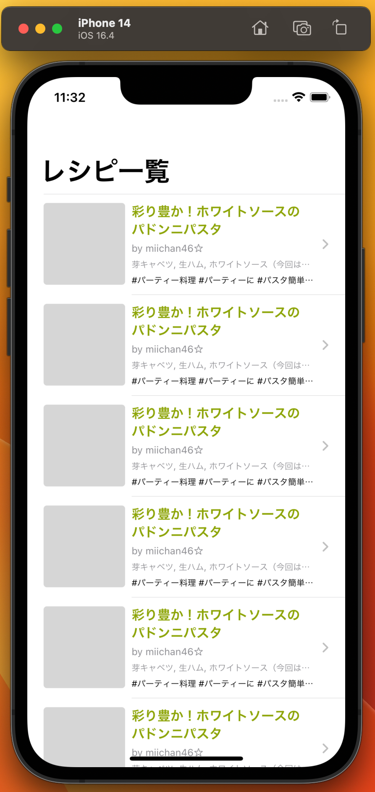
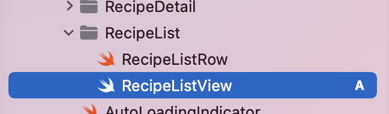
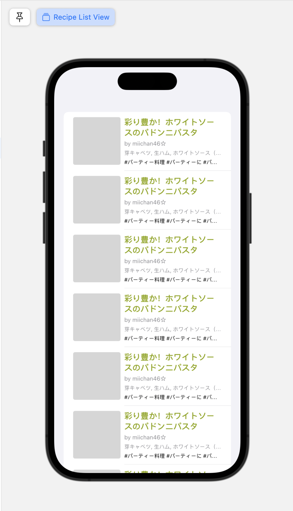
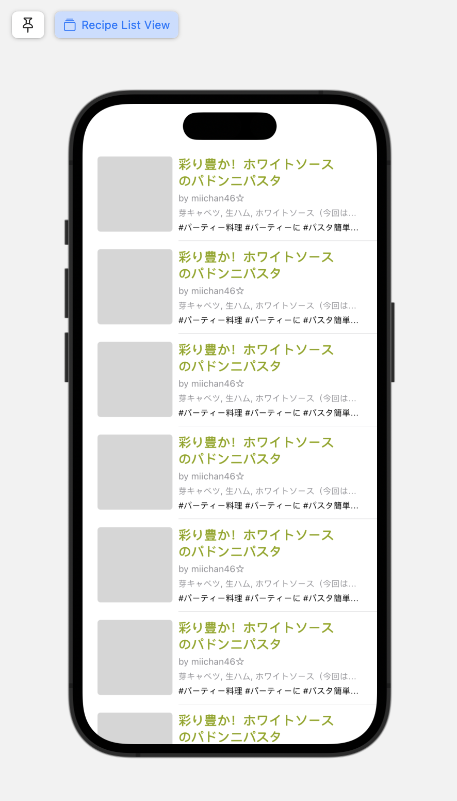
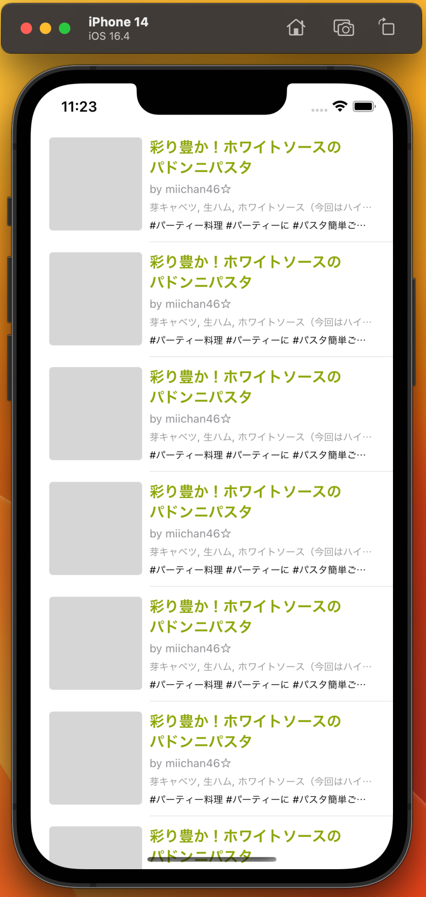
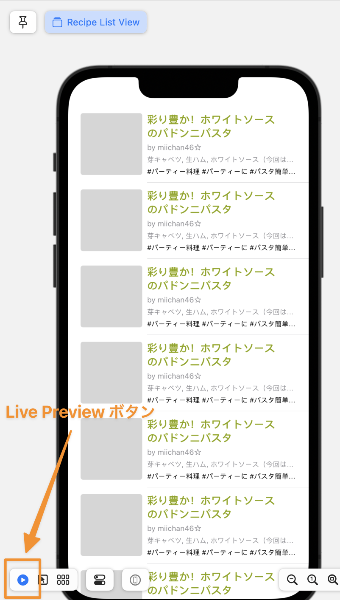
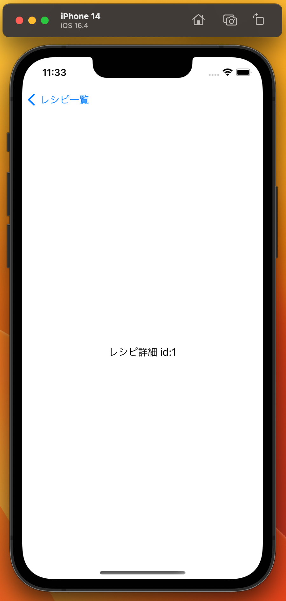

# レシピ一覧画面を作ろう part2

この章では、前の章で作成したレシピの View を使ってレシピをリスト表示し、レシピをタップすると仮のレシピ詳細画面に遷移するところまでを目指します。完成すると、シミュレータまたは Xcode Previews 上で以下の画像のようになります。



この章では、レシピのリスト表示・レシピタップ時の画面遷移を通して

- View をリスト表示する方法
- State による View の状態の保持とプロパティ変更の検知
- View の Identity
- NavigationStack による画面遷移

について学んでいきます。
また、この章はまずはハンズオンを行い、そこで出てきた要素について講義を行うという形式で進めます。

## レシピをリスト表示する

最初に、前章と同じように`RecipeListView.swift`を`View/RecipeList`グループ下に作成します。



```swift
import SwiftUI

struct RecipeListView: View {
    var body: some View {
        Text("Hello, World!")
    }
}

struct RecipeListView_Previews: PreviewProvider {
    static var previews: some View {
        RecipeListView()
    }
}
```

表示するレシピのデータが必要なので、`RecipeListView`に`RecipeListItem`の配列を保持する`items` property を追加します。初期値として空の配列を代入しておきます。

```diff
struct RecipeListView: View {
+   var items: [RecipeListItem] = []
    var body: some View {
        Text("Hello, World!")
    }
}
```

### List

次に、[`List`](https://developer.apple.com/documentation/swiftui/list)という View を使って、レシピのリストを表示します。以下のように List を body 内に記述し、前章で作成した`RecipeListRow`を各行の View にします。

```diff
struct RecipeListView: View {
    var body: some View {
+       List(items, id: \.recipe.id) { item in
+           RecipeListRow(item: item)
+       }
-       Text("Hello, World!")
    }
}
```

このままでは何も表示されないので、Preview でサンプルデータを渡して表示を確認します。既にプロジェクト内にレシピのサンプルデータを返してくれる関数が用意されているので、これを利用します。

```diff
struct RecipeListView_Previews: PreviewProvider {
    static var previews: some View {
-       RecipeListView()
+       RecipeListView(items: RecipeListSampleDataProvider.makeRecipeListSampleData())
    }
}
```



List は`listStyle`という Modifier を使って挙動や見た目を変更することができます。今回は[`PlainListStyle`](https://developer.apple.com/documentation/swiftui/plainliststyle)を指定します。

```diff
    var body: some View {
        List(items, id: \.recipe.id) { item in
            RecipeListRow(item: item)
        }
+       .listStyle(.plain)
    }
```



List の見た目が変わりました。

### View の Identity

`List`の`id`という名前の第 2 引数に、`\.recipe.id`という前章にも出てきた KeyPath を渡しています。これは各行の View の Identifier を指定するために必要なものです。

View の Identity については[WWDC2021 Demystify SwiftUI](https://developer.apple.com/videos/play/wwdc2021/10022/?time=251)で詳しく述べられているのですが、ここではその要旨のみを説明します。

SwiftUI の全ての View は Identity を持っています。
Identity は

- Explicit Identity（明示的な Identity）
- Structural Identity（構造的な Identity）

の 2 種類があり、実装者が明示的に Identifier を指定していない View は、SwiftUI のフレームワークが View 階層の構造を使って構造的な Identity を持ちます。

一方で、`List`のようなデータ駆動型構造のものは、各行の View の Identifier を、データの property をもとに実装者が明示的に指定する必要があります（明示的な Identity）。

Identity は SwiftUI のフレームワークが View を識別する根拠となるものなので、stable(不変)かつ unique(一意)な Identifier を指定するようにしましょう（これらの性質を欠いた Identifier を指定してしまうと、SwiftUI のフレームワークが行う差分更新やアニメーションなどで予期せぬ挙動を引き起こしたり、この後説明する State などが意図せぬタイミングで消えてしまったりします）。

今回は、`GetRecipeListResponse.Recipe`が id を持っており、これは Recipe 全体でユニークです。なので、今回は KeyPath を用いて`\.recipe.id`を渡しています。

### Identifiable

`List`に渡す配列の要素の struct を[`Identifiable`](https://developer.apple.com/documentation/swift/identifiable)という protocol に準拠させることで、KeyPath の指定を省略することができます。

`Entity`グループ内にある`RecipeListItem.swift`を開き、以下のように`Identifiable` protocol への準拠と、protocol が要求する`id` property を指定しましょう。

RecipeListItem.swift

```diff
import Foundation

-struct RecipeListItem {
+struct RecipeListItem: Identifiable {
+   var id: Int64 { recipe.id }
    let recipe: GetRecipeListResponse.Recipe
    let hashtags: [Hashtag]
}
```

これにより、`List`で KeyPath の指定を省略できるようになりました。

```diff
    var body: some View {
-       List(items, id: \.recipe.id) { item in
+       List(items) { item in
            RecipeListRow(item: item)
        }
```

## `items` property の値を更新する

次に、`items` property の値の更新を行なってみます。この章ではまだ Web API との通信などは行いませんが、[Task](https://developer.apple.com/documentation/swift/task)という API を使って、`List`が表示された 1 秒後に`items` property にサンプルデータを代入して property の値を更新してみましょう。 (`Task`API については後ほど詳しく説明します。)

### `@State`

まず最初に、`items` property に`@State`属性を付けます。`@State`属性を付けた property は、それを宣言した View の内部でのみアクセスすべきものなので、`private`を付けておきましょう。

```diff
struct RecipeListView: View {
-    var items: [RecipeListItem] = []
+    @State private var items: [RecipeListItem] = []
+
    var body: some View {
        List(items) { item in
            RecipeListRow(item: item)
        }
        .listStyle(PlainListStyle())
    }
}

struct RecipeListView_Previews: PreviewProvider {
    static var previews: some View {
-       RecipeListView(items: RecipeListSampleDataProvider.makeRecipeListSampleData())
+       RecipeListView()
    }
}
```

[`State`](https://developer.apple.com/documentation/swiftui/state)は View の property の変更を検知する仕組みです。`@State`属性を付けた property の値は、SwiftUI のフレームワークが管理するストレージによって保持され、property の値が変わると、その property に依存している View が SwiftUI のフレームワークによって再描画されるようになります。

### なぜ propety の値を SwiftUI が管理するストレージが保持するのか

なぜ View プロトコルに準拠した struct 自身ではなく、SwiftUI のフレームワークが管理するストレージが property の値を保持するのでしょうか。

RecipeListView などの View プロトコルに準拠した struct は、実際のビューを描画するための設計図のようなものです。RecipeListView のインスタンスが生成されると、`body`が呼ばれ、その出力をもとに実際のビューが描画されます。実際のビューが描画されたら、RecipeListView のインスタンスは SwiftUI のフレームワークによって適切なタイミングで破棄され、再描画のタイミングでインスタンスが再生成されます。つまり、RecipeListView のインスタンスの生存期間は、実際のビューの生存期間よりも非常に短いのです[^1]。

[^1]: [WWDC2020 Data Essentials in SwiftUI](https://developer.apple.com/videos/play/wwdc2020/10040/?time=1406)などで説明されています

そこで、SwiftUI のフレームワークが管理するストレージによって保持することで、実際のビューが生存している間状態を保持することを可能にしています（実際のビューが消えると State も消えます）。

### onAppear

[`onAppear(perform:)`](<https://developer.apple.com/documentation/swiftui/view/onappear(perform:)>)という Modifier を使うと、それを付けた View が画面に表示される直前に処理を実行することができます。`List`に`onAppear(perform:)`Modifier を付け、`List`が表示された 1 秒後に`items` property にサンプルデータを代入して、property の値を更新してみましょう。

```diff
    var body: some View {
        List(items) { item in
            RecipeListRow(item: item)
        }
        .listStyle(PlainListStyle())
+       .onAppear {
+           Task.detached { @MainActor in
+               try await Task.sleep(for: .seconds(1))
+               items = RecipeListSampleDataProvider.makeRecipeListSampleData()
+           }
+       }
    }
```

では、実際の表示をシミュレータを使って確認してみます。
現状はアプリを起動した時に表示される View が`ContentView`になっているので、`MiniCookpadApp.swift`を開き、アプリ起動後に表示される View を`RecipeListView`にします。

MiniCookpadApp.swift

```diff
import SwiftUI

@main
struct MiniCookpadApp: App {
    var body: some Scene {
        WindowGroup {
-           ContentView()
+           RecipeListView()
        }
    }
}
```

ここまででシミュレータを実行してみましょう。しばらく待った後に先程のサンプルデータが表示されれば OK です。



または、`RecipeListView`の Xcode Previews の Live Preview ボタンを押すことでも表示を確認することができます。  
Xcode 14 からはデフォルトで Live Preview となっているため、Previews を動作させるだけで表示を確認できます。



## 画面遷移

最後に、リストの各行のレシピをタップして画面遷移ができるようにしましょう。

### NavigationStack

最初に、画面遷移をするためには`RecipeListView`を[`NavigationStack`](https://developer.apple.com/documentation/swiftui/navigationstack)で囲う必要があります。  
`NavigationStack`は iOS 16 から利用できるようになった、階層的な画面遷移を管理するための API です。

`MiniCookpadApp.swift`を開いて、以下のように記述します。

```diff
import SwiftUI

@main
struct MiniCookpadApp: App {
    var body: some Scene {
        WindowGroup {
-           RecipeListView()
+           NavigationStack {
+               RecipeListView()
+           }
        }
    }
}
```

同様に`RecipeListView.swift`を開いて、Preview も`NavigationStack`で囲っておきます。

```diff
struct RecipeListView_Previews: PreviewProvider {
    static var previews: some View {
-       RecipeListView()
+       NavigationStack {
+           RecipeListView()
+       }
    }
}
```

### NavigationLink

次に、レシピ一覧画面のレシピをタップしたら、レシピ詳細画面に遷移できるようにします。画面遷移の方法は様々な種類がありますが、今回は[`NavigationLink`](https://developer.apple.com/documentation/swiftui/navigationlink)を使った画面遷移が適しているので、これを使います。

`RecipeListView.swift`を開いて、`RecipeListRow`を`NavigationLink`で囲います。まだレシピ詳細画面の View は作成しないので、仮で`Text`を遷移先に指定します。

```diff
struct RecipeListView: View {
    @State private var items: [RecipeListItem] = []

    var body: some View {
        List(items) { item in
-           RecipeListRow(item: item)
+           NavigationLink {
+               Text("レシピ詳細 id:\(item.recipe.id)")
+           } label: {
+               RecipeListRow(item: item)
+           }
        }
        .listStyle(PlainListStyle())
```

仕上げに`navigationTitle`Modifier を使って、タイトルの設定をします。タイトルは`レシピ一覧`にしておきます。

```diff
struct RecipeListView: View {
    @State private var items: [RecipeListItem] = []

    var body: some View {
        List(items) { item in
            // ...
        }
        .listStyle(.plain)
        .onAppear {
            // ...
        }
+       .navigationTitle("レシピ一覧")
    }
}
```

## 確認

お疲れさまでした！
ここでシミュレータを実行し、以下の表示になっていれば OK です！

|                       一覧                        |                        詳細                         |
| :-----------------------------------------------: | :-------------------------------------------------: |
|  |  |

---

[Chapter4 へ進む](chapter_04.md)
