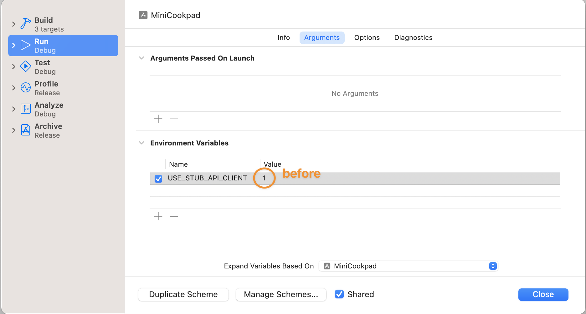

# レシピ一覧画面を作ろう part3

この章では、いよいよレシピ一覧画面で Web API からデータを取得して表示します。
完成すると、シミュレータ上で以下の画像のようになります。


この章では

- ViewModel を導入して、API リクエストとデータの更新を View から分離する方法
- ObservableObject に準拠したクラスのインスタンスのプロパティ変更の検知
- Swift Concurrency を使った非同期処理
- MainActor を使ったメインスレッド上での処理の実行

について学んでいきます。

## ViewModel を作る

### なぜ ViewModel を作るのか

API 通信処理なども全て View に記述してしまうと、View は瞬く間に肥大化し、コードの可読性が悪くなってしまいます。そこで今回 API リクエストを送るにあたり、ViewModel というクラスを新たに作成します。

ViewModel は主に MVVM アーキテクチャで使われるもので責務にもいくつかのバリエーションがありますが、今回作成する ViewModel は簡易的なアーキテクチャとして「View からのインプットに応じて API リクエストを行い、自身が保持しているデータを更新するもの」として定義します。View は、API リクエストの詳細は ViewModel に任せつつ、ViewModel のデータを監視し、データの更新があったら View を再描画します。


### RecipeListViewModel

それでは実際に、ViewModel を作成していきます。
プロジェクトに`RecipeListViewModel.swift`ファイルを追加します。`View/RecipeList`グループを右クリックし、New File...を選択します。


`Swift File`を選択し、ダブルクリックをするか、`Next`ボタンをクリックしてください。


`RecipeListViewModel`という名前に変え、`Create`ボタンをクリックします。
その際`Targets`のチェックが`MiniCookpad`に**のみ**入っていることを確認してください。

新規に作られた`RecipeListViewModel.swift`のファイルを、以下のように書き換えます。

```swift
final class RecipeListViewModel {}
```

### ObservableObject

次に、ViewModel のデータを View が監視できるようにします。

まず、RecipeListViewModel を[`ObservableObject`](https://developer.apple.com/documentation/combine/observableobject) protocol に準拠させ、`@Published`属性をつけた`items` property を追加します。  
Swift における`@Xxxxxxx`は Property Wrapper と呼ばれているものです。Property Wrapper は、プロパティの保存方法を管理するコードとプロパティを定義するコードとの間に層を追加することができるものです。  
本講義では Property Wrapper のことは「属性」と表現しています。  
自分で Property Wrapper を作るわけではないため、ここでは詳細については割愛しますが、もし興味がある方は [The Swift Programming Language の Property Wrappers](https://docs.swift.org/swift-book/documentation/the-swift-programming-language/properties/#Property-Wrappers) などを参照してみてください。

以下のように記述してください。

```diff
+import Combine
+
-final class RecipeListViewModel {}
+final class RecipeListViewModel: ObservableObject {
+    @Published var items: [RecipeListItem] = []
+}
```

(ここで import している Combine については、講義の本質とは逸れるため解説を割愛します。詳しく知りたい方は Apple Developer Documentation の [Combine](https://developer.apple.com/documentation/combine) や [Using Combine for Your App’s Asynchronous Code](https://developer.apple.com/documentation/combine/using-combine-for-your-app-s-asynchronous-code) などを見てみてください。)

`ObservableObject` protocol に class を準拠させると `@Published` を利用して View から property の変更を監視することができるようになります。

### StateObject

では、View はどのようにして`ObservableObject` protocol に準拠したクラスの property の変更を監視するのでしょうか。

View で `ObservableObject` の変更を監視するための属性が 3 つあります。それは[`StateObject`](https://developer.apple.com/documentation/swiftui/stateobject)、[`ObservedObject`](https://developer.apple.com/documentation/swiftui/observedobject)、[`EnvironmentObject`](https://developer.apple.com/documentation/swiftui/environmentobject)です。  
このうちのいずれかの属性を`ObservableObject` に準拠した class に付けて View の property に追加し、`@Published` な property を View で利用すれば、property に変更があった時に自動的に View が再描画されます。

今回は`RecipeListViewModel`のインスタンス化を`RecipeListView`内で行うため、`StateObject`を選択します（残りの 2 つについては Apple のドキュメントを各自で見てください）。`RecipeListView.swift`を開いて、以下のように記述してください。

RecipeListView.swift

```diff
struct RecipeListView: View {
-   @State private var items: [RecipeListItem] = []
+   @StateObject private var viewModel = RecipeListViewModel()

    var body: some View {
```

この変更だけではエラーが出てしまうので、以下のようにコードを書き換え、RecipeListViewModel の`items` property を使うようにします。

```diff
struct RecipeListView: View {
    @StateObject private var viewModel = RecipeListViewModel()

    var body: some View {
-       List(items) { item in
+       List(viewModel.items) { item in
            NavigationLink {
                Text("レシピ詳細 id:\(item.recipe.id)")
            } label: {
                RecipeListRow(item: item)
            }
        }
        .listStyle(.plain)
        .onAppear {
            Task.detached { @MainActor in
                try await Task.sleep(for: .seconds(1))
-               items = RecipeListSampleDataProvider.makeRecipeListSampleData()
+               viewModel.items = RecipeListSampleDataProvider.makeRecipeListSampleData()
            }
        }
        .navigationTitle("レシピ一覧")
    }
}
```

ここまでできたら、シミュレータを実行し、前章と同じくしばらく待った後にサンプルデータが表示されれば OK です。RecipeListViewModel インスタンスの`items` property を変更して、RecipeListView を再描画することができました。


## API クライアントの実装・API リクエストの仕組み解説

今回、API リクエストを送る API クライアントクラスは、講義時間の都合上既にプロジェクト内に用意されています。ここでは、既に追加されている API クライアントが、どのようにして API リクエストを送るのかについて先に解説しておきます。  
解説は行いますが、API クライアントをどのように利用するかだけ掴めれば、実際の仕組みについて理解する必要はありません。

### Networking/APIClient/APIClient.swift

`func send(request: Request)`メソッドは、[`URLSession`](https://developer.apple.com/documentation/foundation/urlsession)を使って API リクエストを行い、API から返ってきたレスポンスの JSON を、リクエスト時に指定した struct にデコードして結果を返します。

途中でエラーが発生した場合は、`APIClientError`で定義されたいずれかのエラーを throw します。

### Networking/APIClient/APIRequest.swift、Networking/Request

API リクエストを送るには、`APIRequest` protocol に準拠した struct をリクエストごとに定義します。

今回行う API リクエストは、`Networking/Request`グループ内に既に定義されています。
この章で使う`Networking/Request/GetRecipeListRequest.swift`の実装を見てみましょう。

```swift
struct GetRecipeListRequest: APIRequest {
    typealias Response = GetRecipeListResponse
```

まずはレスポンスの JSON をどの struct にデコードするかを指定しています。
Response は、APIRequest protocol では`associatedtype`として指定されていて、この型を具体的に指定しているのが上記のコードです。`associatedtype`は protocol で使われる型のプレースホルダーのようなもので、APIRequest に準拠する側が具体的な型を指定することで、API リクエストごとに、レスポンスの JSON を異なる struct にデコードすることができています。

```swift
protocol APIRequest {
    associatedtype Response: Decodable
```

`queryItems`ではクエリストリングの追加を行うことができます。用意されているコードでは`[URLQueryItem]`に`limit`だけが指定されており、この場合 API リクエストは `https://localhost:3001/recipes?limit=10` となります。

```swift
    var queryItems: [URLQueryItem] {
        let items: [URLQueryItem] = [.init(name: "limit", value: String(limit))]
        return items
    }
}
```

最後に、`GetRecipeListResponse`について見てみましょう。
[`Decodable`](https://developer.apple.com/documentation/swift/decodable)は、JSON などをデコードする際に準拠する protocol で、今回は[`JSONDecoder`](https://developer.apple.com/documentation/foundation/jsondecoder)の`keyDecodingStrategy`の指定を[`convertFromSnakeCase`](https://developer.apple.com/documentation/foundation/jsondecoder/keydecodingstrategy/convertfromsnakecase)にしているため、レスポンスの JSON のキー（snake case）は lower camel case に自動で変換されています。その変換後のキー名と同じ名前で、Response の struct にデコードする property を追加していきます。

```swift
extension APIRequest {
    func makeResponse(from data: Data, urlResponse: HTTPURLResponse) throws -> Response {
        let decoder = JSONDecoder()
        decoder.keyDecodingStrategy = .convertFromSnakeCase
        return try decoder.decode(Response.self, from: data)
    }
}
```

```swift
struct GetRecipeListResponse: Decodable {
    struct Recipe: Decodable {
        struct User: Decodable {
            let name: String
        }

        struct Ingredient: Decodable {
            let name: String
        }

        let id: Int64
        let title: String
        let description: String
        let imageUrl: String?
        let user: User
        let ingredients: [Ingredient]
    }

    let recipes: [Recipe]
}
```

### Networking/Stub

これは、Xcode Previews や通信が上手くいかない時などにスタブのデータを返せるようにしたものなので、説明は割愛します。

## Web API と通信する

では、実際に Web API にリクエストを送る部分を実装していきます。

事前準備として、サンプルデータを追加する処理を削除しておきましょう。

```diff
    var body: some View {
        List(viewModel.items) { item in
            NavigationLink {
                Text("レシピ詳細 id:\(item.recipe.id)")
            } label: {
                RecipeListRow(item: item)
            }
        }
        .listStyle(.plain)
-       .onAppear {
-           Task.detached { @MainActor in
-               try await Task.sleep(for: .seconds(1))
-               viewModel.items = RecipeListSampleDataProvider.makeRecipeListSampleData()
-           }
-       }
        .navigationTitle("レシピ一覧")
    }
```

そして、`MiniCookpadApp.swift`を開いて、(本来は不必要にグローバル変数を増やすのは良くありませんが、講義の簡略化のため)`apiClient`変数をグローバル変数として定義します。

```diff
import SwiftUI

// 今回の講義では簡略化のためAPIクライアントをグローバル変数で定義する
+let apiClient: APIClient = {
+    if ProcessInfo.processInfo.isRunningForPreview || ProcessInfo.processInfo.useStubAPIClient {
+        return StubAPIClient()
+    } else {
+        return MiniCookpadAPIClient()
+    }
+}()

@main
struct MiniCookpadApp: App {
    var body: some Scene {
        WindowGroup {
            NavigationStack {
                RecipeListView()
            }
        }
    }
}
```

### Swift Concurrency

[Swift Concurrency](https://docs.swift.org/swift-book/documentation/the-swift-programming-language/concurrency/)は、Swift 5.5 で追加された非同期処理と並行処理を安全かつ簡潔に記述できる言語機能です。

実際に`RecipeListViewModel.swift`に API 通信の処理を記述しながら、Swift Concurrency について学んでいきましょう。

まずは、RecipeListViewModel に、API リクエストを送り保持しているデータを更新する`request()`メソッドを追加しましょう。以下のように記述してください。

```diff
final class RecipeListViewModel: ObservableObject {
    @Published var items: [RecipeListItem] = []

+   func request() async {}
}
```

`request()`メソッドは非同期なので、非同期であることを示すために`async`キーワードを付けます。これを付けることで、`request()`メソッド内で他の`async`のついた関数を呼び出すことができるようになりました。

次に、先程説明した API クライアントを使って

- レシピ情報を取得するために `https://localhost:3001/recipes`
- レシピに紐付いたハッシュタグを取得するために `https://localhost:3002/recipe_hashtags`

にそれぞれ API リクエストを送りましょう。
`func send(request: Request)`メソッドはエラーを throw するメソッドなので、do-catch で囲った上で、メソッド呼び出し時に`try`キーワードをつけます。本来であればエラー時はユーザーに対してエラー画面を表示するべきですが、今回は簡略化のため、エラー時は print 関数でコンソールにエラー内容を出力するにとどめます。

```diff
    func request() async {
+       do {
+           let recipeListResponse = try await apiClient.send(request: GetRecipeListRequest())
+           let recipeHashtagsResponse = try await apiClient.send(request: GetRecipeHashtagsRequest(recipeIds: recipeListResponse.recipes.map(\.id)))
+       } catch {
+           print(error)
+       }
    }
```

`await`キーワードは、ここで関数内の処理の実行が一時停止することを示すためのキーワードです。
非同期なメソッド`func send(request: Request)`を呼んでその結果が得られるまで、request メソッド内の処理は中断されます。非同期で API 通信を行いその結果が得られたら、後続の処理が再開されます。

最後に、2 つの API から取得したデータを合わせて RecipeListViewModel の`items` property を更新しましょう。
ここはあまり本質的でない箇所なので、以下のコードをそのまま貼り付けてもらえれば大丈夫です。

```diff
    func request() async {
        do {
            let recipeListResponse = try await apiClient.send(request: GetRecipeListRequest())
            let recipeHashtagsResponse = try await apiClient.send(request: GetRecipeHashtagsRequest(recipeIds: recipeListResponse.recipes.map(\.id)))
+
+           var newItems: [RecipeListItem] = []
+           for (recipe, recipeHashtags) in zip(recipeListResponse.recipes, recipeHashtagsResponse.recipeHashtags) {
+               if recipe.id != recipeHashtags.recipeId {
+                   fatalError("今回は必ずrecipe_idを送った順にレシピに紐付くハッシュタグがAPIから返ってくることが保証されているとして進める")
+               }
+               newItems.append(.init(recipe: recipe, hashtags: recipeHashtags.hashtags))
+           }
+
+           items = newItems
        } catch {
            print(error)
        }
    }
```

### API リクエストを送り、結果を画面に表示する

それでは最後に、`RecipeListView.swift`に RecipeListViewModel の`request()`メソッドを呼び出す処理を記述して、API で取得した結果を画面に表示してみましょう。

サンプルデータを表示した時と同じように以下のように記述してみましょう。

```diff
struct RecipeListView: View {
    @StateObject private var viewModel = RecipeListViewModel()

    var body: some View {
        List(viewModel.items) { item in
            NavigationLink(destination: Text("レシピ詳細 id:\(item.recipe.id)")) {
                RecipeListRow(item: item)
            }
        }
        .listStyle(PlainListStyle())
+       .onAppear {
+           await viewModel.request()
+       }
        .navigationTitle("レシピ一覧")
    }
}
```

`Invalid conversion from 'async' function of type '() async -> ()' to synchronous function type '() -> Void'`というエラーが出てしまいました。

これは`onAppear`の引数 perform に渡すクロージャに`async`がついていないため、このクロージャ内で`async`のついたメソッドを呼び出すことはできないからです。

これを解決するには、`viewModel.request()`の呼び出しを[`Task`](https://developer.apple.com/documentation/swift/task)で囲います。

```diff
        .onAppear {
-           await viewModel.request()
+           Task {
+               await viewModel.request()
+           }
        }
```

Task は「プログラムの一部として非同期で実行できる作業の単位」[^1]と定義されており、全ての`async`のついた非同期関数はあるタスクの一部として実行されます。

[^1]: [Tasks and Task Groups](https://docs.swift.org/swift-book/documentation/the-swift-programming-language/concurrency/#Tasks-and-Task-Groups)の記述の訳

Task の後のクロージャは[`Task.init(priority:operation:)`](<https://developer.apple.com/documentation/swift/task/init(priority:operation:)-5ltye>)の Trailing Closure で、`operation`クロージャには`async`キーワードがついています。これにより`async`な function である`viewModel.request()`を呼び出すことができます。

なお、View が表示される直前に何らかの非同期処理を行いたい場合は[`task(priority:_:)`](<https://developer.apple.com/documentation/swiftui/view/task(priority:_:)>) Modifier を使うとより簡潔に記述することができます(加えて、Task が完了していない時にビューが消えた時に SwiftUI のフレームワークがその Task をキャンセルしてくれます)。

```diff
        }
        .listStyle(PlainListStyle())
-       .onAppear {
-           Task {
-               await viewModel.request()
-           }
-       }
+       .task {
+           await viewModel.request()
+       }
        .navigationTitle("レシピ一覧")
```

ここまでで一度、シミュレータを実行してみましょう。今はスタブ用の API クライアントを使っているため、前章と同じサンプルデータが表示されていれば OK です。


### MainActor

シミュレータ実行中に、`RecipeListViewModel.swift`を開いてみましょう。`items` property の値を変更している行で、紫色の警告が表示されているはずです。

```swift
                newItems.append(.init(recipe: recipe, hashtags: recipeHashtags.hashtags))
            }
            // ⚠️ Publishing changes from background threads is not allowed; make sure to publish values from the main thread (via operators like receive(on:)) on model updates.
            items = newItems
        } catch {
            print(error)
        }
```

iOS アプリでは、UI に関する状態の変更は必ずメインスレッドから実行する必要があります。
つまり、`@Published`属性が付いている値を変更する処理（=`items` property の値の変更）もメインスレッドから実行する必要があります。

RecipeListViewModel の型に[`@MainActor`](https://developer.apple.com/documentation/swift/mainactor)属性をつけることで、クラス内の処理が必ずメインスレッドで実行されるようになります。以下のように RecipeListViewModel に`@MainActor`属性を追加し、先程の紫色の警告が出なくなっていることを確認しましょう。

```diff
import SwiftUI

+@MainActor
final class RecipeListViewModel: ObservableObject {
    @Published var items: [RecipeListItem] = []
```

[`Actor`](https://github.com/apple/swift-evolution/blob/main/proposals/0306-actors.md)は、並行処理において状態を安全に共有可能にするために新たに Swift に導入された型です。ここでは Actor についての詳細な説明は割愛しますが、興味のある方は[The Swift Programming Language の Concurrency](https://docs.swift.org/swift-book/documentation/the-swift-programming-language/concurrency/)などを見てみてください。

MainActor はグローバルアクターと呼ばれ、グローバルに一意な Actor です。MainActor は`DispatchQueue.main`相当の executor を保持しているため、`@MainActor`属性を追加したクラス内の処理は、必ずメインスレッドでの実行となります。

### 実際に API と通信する

では最後に、実際の Web API にリクエストを送ってみましょう。
実際の通信を行う API クライアントに切り替えるためには、エディタ上部のシミュレータ選択の隣、「MiniCookpad」と書かれた部分を押してから、「Edit Scheme...」を選択します。


「Run」が選択されていることを確認した後、「Environment Variables」にある「USE_STUB_API_CLIENT」という環境変数の値を 1 から 0 に変更して右下の「Close」を押します。

before


after


もう一度シミュレータを実行してみましょう。スタブではない実際のレシピのデータが表示されていれば実際に API にリクエストできています。


ただ、実際に表示された画像を見てみると、どうやら画像がかなり歪んでしまっているようです。最後にこれを少し修正していきます。

現在、画像を表示している`RecipeList/RecipeListRow.swift`のコードは以下のようになっていました。

```swift
struct RecipeListRow: View {
    let item: RecipeListItem
    var body: some View {
        HStack(alignment: .top, spacing: 8) {
            AsyncImage(url: URL(string: item.recipe.imageUrl ?? ""))
                .frame(width: 100, height: 100)
                .cornerRadius(4)
```

ここでは`AsyncImage`に対して`frame`を指定することで 100x100 のサイズの View を表現していますが、API リクエストの結果受け取った画像の縦横比は指定されていないため、画像が歪んでしまうという現象が起きています。

この問題を解決するためには、[`Image`](https://developer.apple.com/documentation/swiftui/image)をリサイズするための[`resizable`](<https://developer.apple.com/documentation/swiftui/image/resizable(capinsets:resizingmode:)>)という Modifier を利用する必要があります。

`resizable`Modifier は`Image`に対してしか利用できず、`AsyncImage`は`Image`ではないため、そのまま`resizable`を適用することはできません。  
ただ、`AsyncImage`には[`.init(url:scale:content:placeholder)`](<https://developer.apple.com/documentation/swiftui/asyncimage/init(url:scale:content:placeholder:)>)という initializer が存在しており、それを利用することで`Image`を手に入れることができるのでやってみましょう。

```diff
struct RecipeListRow: View {
    let item: RecipeListItem
    var body: some View {
        HStack(alignment: .top, spacing: 8) {
-            AsyncImage(url: URL(string: item.recipe.imageUrl ?? ""))
-                .frame(width: 100, height: 100)
-                .cornerRadius(4)
+            AsyncImage(url: URL(string: item.recipe.imageUrl ?? "")) { image in
+                image.resizable()
+            } placeholder: {
+                Color.gray
+            }
+            .frame(width: 100, height: 100)
+            .cornerRadius(4)
```


これでそれらしい見た目の画像にすることはできました。  
しかし、よく見てみると画像のアスペクト比はまだ少し崩れています。(ラムラグーのパスタやラムラグーのグラタンなどがわかりやすいと思います。)

`resizable`を利用したことで`Image`が表示領域にフィットするように ある程度調整してくれるようにはなりましたが、画像のアスペクト比までは指定していないため、このようになってしまっています。

こちらに関しては次の章の課題にしようと思うので、一旦無視して次の章に進むことにします。

---

[Chapter5 へ進む](chapter_05.md)
