# 課題 ① レシピ詳細画面を作ろう

この課題では、レシピ詳細画面を作ります。
完成すると、以下の画像のようになります。

|                      ①                       |                      ②                       |                      ③                       |
| :------------------------------------------: | :------------------------------------------: | :------------------------------------------: |
| 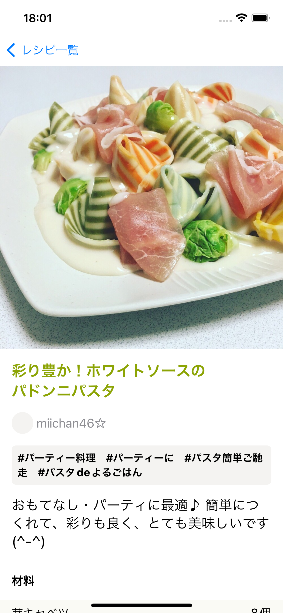 | 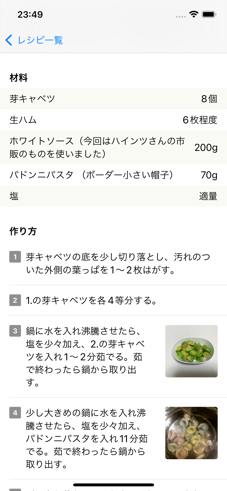 | 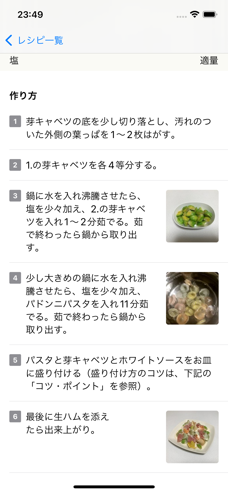 |

## 仕様

以下の仕様を満たすレシピ詳細画面を作成してください。

### 画面遷移

- レシピ一覧画面からタップされたレシピの`id`を受け取ってレシピ詳細画面に遷移する
  - レシピ詳細画面の View は `RecipeDetailView.swift` という名前で作成すること

### API 通信

- レシピ一覧画面から受け取ったレシピの`id`を使ってレシピ詳細画面表示時に API リクエストを送り、レシピの詳細情報を取得する
  - `RecipeDetailViewModel.swift` という名前で ViewModel を作成し、API リクエスト及び画面に表示するデータの更新は RecipeDetailViewModel 内で行うこと

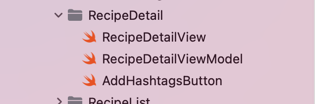

- `GetRecipeDetailRequest`と`GetRecipeHashtagsRequest`、2 つの API リクエストは並列で行う
  - レシピ一覧は 2 つの API リクエストを直列で行なっていましたが、レシピ詳細画面の API リクエストで使用する`GetRecipeDetailRequest`と`GetRecipeHashtagsRequest`に必要なパラメータ（レシピの`id`）は既に持っているため、この 2 つの API リクエストは並列で実行することができます
  - API リクエストを並列で行う方法については[Swift の Language Guide](https://docs.swift.org/swift-book/documentation/the-swift-programming-language/concurrency/)などで調べてみましょう
- `GetRecipeDetailRequest`と`GetRecipeHashtagsRequest`のレスポンスは`Entity/RecipeDetailItem`にまとめる

### 画面

- レシピ画像を画面幅いっぱいに広げて見せる
  - 画像の縦横比は崩さない
  - 画像は正方形（縦横比 1:1）でクロップする
  - 必要であれば「補足 1」も見てください


- レシピタイトルを表示する
  - 文字は太字
  - 文字色は `Color.recipeTitle`

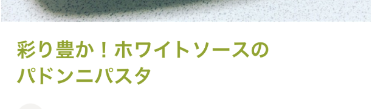

- 作者アイコンを表示する
  - `30x30`の大きさ
  - 画像は丸くして表示する
- 作者名を表示する

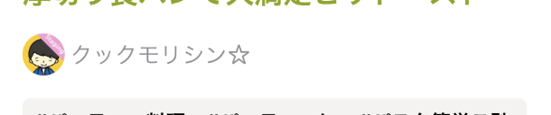

- レシピに紐づくハッシュタグを表示する
  - 文字は太字
  - 最大行数は 2
  - 背景色は `Color.smoke` で画面幅いっぱいに表示する
  - `6px`の角丸を付ける

|                         1 行                         |                         2 行                         |
| :--------------------------------------------------: | :--------------------------------------------------: |
| 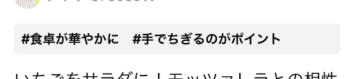 | 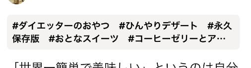 |

- レシピの説明文を表示する

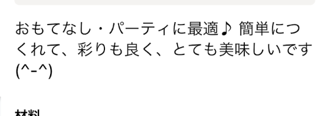

- 材料欄を表示する
  - 「`材料`」というセクションヘッダーを先頭に付ける
    - 文字は太字
  - 材料名を左揃え、分量を右揃えで表示
  - 最初の行を 0 行目とした時に
    - 偶数行（0 行目、2 行目...）の背景色は `Color.ivory`
    - 奇数行（1 行目、3 行目...）の背景色は `Color.white`

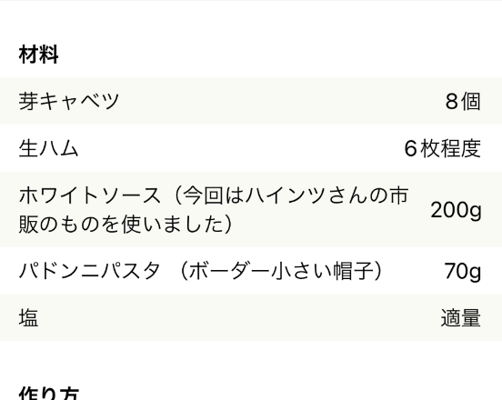

- 作り方欄を表示する
  - 「`作り方`」というセクションヘッダーを先頭に付ける
    - 文字は太字
  - 作り方の行の左側に番号を付ける
    - 最初の行を 0 行目とした時に、0 行目には「1」という番号を付ける
  - 作り方の説明を表示する
  - 作り方の画像がある場合は、右側に表示する
    - `90x90`の大きさ
    - `4px`の角丸を付ける
  - 各行の間に区切り線を表示する
    - 左側の余白は`16px`
    - 右側の余白はなし

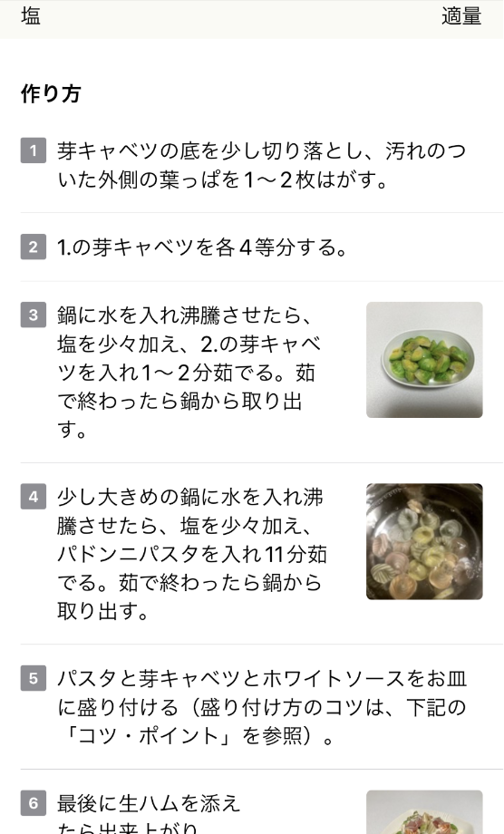

- レシピ写真以外の左右の余白は`16px`ずつ
  - ただし材料欄の背景色は画面幅いっぱいに広げる

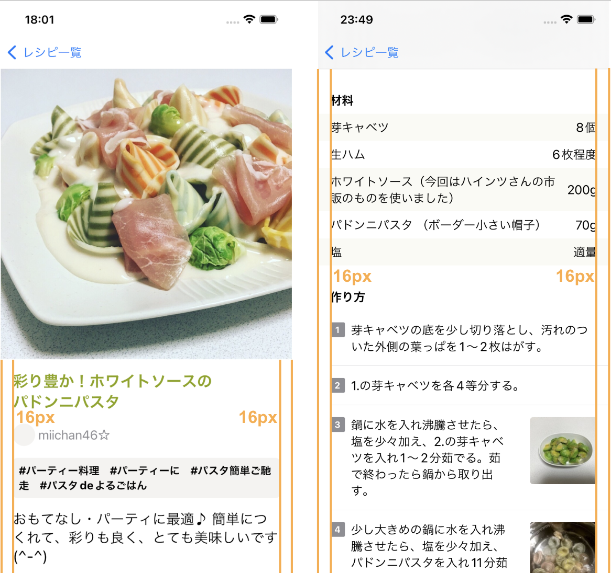

#### 上下の余白

8 の倍数（8px, 16px, 24px, 32px...）のうち適切だと思うものを利用してください。

#### フォントサイズ

- レシピタイトル: `.title2`
- 作者名: `.body`
- ハッシュタグ: `.subheadline`
- レシピの説明文: `.title3`
- 「材料」「作り方」のセクションヘッダー: `.headline`
- 材料欄の各行: 指定なし
- 作り方欄の各行: 指定なし

#### 文字色

- レシピタイトル: `.recipeTitle`
- 作者名: `.gray`
- ハッシュタグ: `.black`
- レシピの説明文: `.black`
- 「材料」「作り方」のセクションヘッダー: `.black`
- 材料欄の各行: 指定なし
- 作り方欄の各行: 指定なし

## 追加課題（余力がある人はチャレンジしてみよう）

chapter_04 で説明したように、レシピ一覧のレシピ画像の縦横比が画像の元々の縦横比と異なるため、画像が歪んでしまっています。こちらも画像の縦横比を崩さずに正方形（縦横比 1:1）でクロップしてみましょう

## [補足 1] 画像を正方形（縦横比 1:1）でクロップする

画像を正方形（縦横比 1:1）でクロップする、について少し補足をします。

[`aspectRatio(_:contentMode:)`](<https://developer.apple.com/documentation/swiftui/view/aspectratio(_:contentmode:)-771ow>)という Modifier を使うと、View の縦横比（アスペクト比）を指定することができます。

```swift
Image(uiImage: image)
    .resizable()
    .aspectRatio(1.0, contentMode: .fill)
```

しかし、`aspectRatio(1.0, contentMode: .fill)`を指定しただけだと画像の縦横比が元の画像と一致しないため、画像は歪んだままとなってしまいます。

今回の要件である「画像の縦横比は崩さずに画像を正方形 (縦横比 1:1) でクロップする」はどのようにすれば実現できるでしょうか。各自で[Fitting images into available space](https://developer.apple.com/documentation/swiftui/fitting-images-into-available-space)などを参考に取り組んでみましょう。

---

[Chapter6 へ進む](chapter_06.md)
