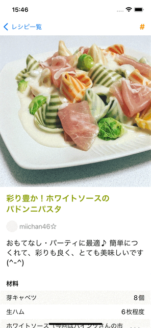

# 基礎課題 ② ハッシュタグ追加画面を作ろう

この基礎課題では、ハッシュタグ追加画面を作ります。
完成すると、以下の gif 画像のようになります。



**＊補足**
クックパッドのレシピサービスでは、ハッシュタグはレシピにつくれぽを投稿する際に付けるものであり、本来はレシピではなくつくれぽに紐付くものです。今回の講義では簡略化のため、ハッシュタグをレシピに紐付けるものとして進めます。

## 仕様

以下の仕様を満たすハッシュタグ追加画面を作成してください。

### 画面遷移

- ナビゲーションバー右の「#」ボタンをタップすると、ハッシュタグ追加画面をモーダル表示する
  - 「#」ボタンは `View/RecipeDetail/AddHashtagsButton.swift`という名前で既にプロジェクト内に用意されています
  - ハッシュタグ追加画面は`View/AddRecipeHashtags/AddRecipeHashtagsView.swift`という名前で既にプロジェクト内に用意されています

### 画面、API 通信

#### ハッシュタグ追加画面でユーザーが「ハッシュタグを追加する」ボタンをタップした時

- 以下の仕様でユーザーが入力したテキストをトリムする
  - 全角スペースを半角スペースに変換
  - 全角のハッシュタグ(＃)を半角のハッシュタグ(#)に変換
  - テキストの前後のスペース及び改行を削除
- トリムしたテキストを使ってハッシュタグを追加する POST リクエストを送る
  - `Networking/Request/PostRecipeHashtagsRequest.swift`を使います
  - API リクエストの仕様は「参考:トリムしたテキストを使ってハッシュタグを追加する POST リクエストを送る」を参照してください
  - 今回は ViewModel の作成は任意です
- API リクエストが成功したら「ハッシュタグを追加しました」というアラートを表示する
  - アラート内の「OK ボタン」を押したら、AddRecipeHashtagsView を閉じてレシピ詳細画面に戻る
- レシピ詳細画面に戻ると、追加したハッシュタグがハッシュタグ枠に表示されている

## 参考

### `USE_STUB_API_CLIENT`

環境変数`USE_STUB_API_CLIENT`を`1`にすると、サーバー側にリクエストを送らず擬似的に POST リクエストを試すことができます（リクエストに必要なパラメータが不足していても実行できます）。

`USE_STUB_API_CLIENT`を`1`にした場合、以下のレスポンスが固定で返ってきます。開発途中など、実際に API リクエストを行わずに開発を行いたい時に必要に応じて使ってください。

```json
{
  "hashtags": [
    { "id": 1, "name": "平日のお昼に" },
    { "id": 2, "name": "リピート決定" }
  ]
}
```

### ナビゲーションバー右に「#」ボタンを表示する

[`toolbar`](<https://developer.apple.com/documentation/swiftui/view/toolbar(content:)-5w0tj>)という Modifier を、レシピ詳細画面の ScrollView に付与することで実現できます。

これは使い方を覚える方が早いので、以下のようなコードを RecipeDetailView 内に付与してみましょう。

```swift
.toolbar {
    ToolbarItemGroup(placement: .navigationBarTrailing) {
        // let item = レシピ詳細画面に表示しているRecipeDetailItemを取得
        AddHashtagsButton(item: item)
    }
}
```

### 「#」ボタンをタップすると、ハッシュタグ追加画面をモーダル表示する

`View/RecipeDetail/AddHashtagsButton.swift` にハッシュタグ追加画面をモーダル表示するコードを追加しましょう

```swift
import SwiftUI

struct AddHashtagsButton: View {
    let item: RecipeDetailItem

    var body: some View {
        Button(action: {
            // Try: ボタンタップ時にAddRecipeHashtagsViewをモーダル表示する
        }, label: {
            Text("#")
                .font(.title3)
                .fontWeight(.bold)
                .foregroundColor(Color.orange)
        })
    }
}
```

### ユーザーが入力したテキストをトリムする

Swift で文字列の置換やトリムはどのように行うのか、各自調べてみましょう。

### トリムしたテキストを使ってハッシュタグを追加する POST リクエストを送る

`https://localhost:3002/hashtags`に対して、以下のような POST リクエストを送ります。

```bash
$ curl -X POST -H "Content-Type: application/json" -d '{"recipe_id": 4961134, "value": "#平日のお昼に #リピート決定"}' https://localhost:3002/hashtags
```

レスポンスは、以下のように追加したハッシュタグが配列で返ってきます。(id は異なる可能性があります。)

```bash
{"hashtags":[{"id":1,"name":"平日のお昼に"},{"id":2,"name":"リピート決定"}]}
```

`Networking/Request/PostRecipeHashtagsRequest.swift`で、`body`に`recipe_id`と`value`を追加してリクエストを送ってみましょう。

```swift
import Foundation

struct PostRecipeHashtagsRequest: APIRequest {
    typealias Response = PostRecipeListResponse
    let url = URL(string: "https://localhost:3002/hashtags")!
    let method: HTTPMethod = .post

    // Try: body に recipe_id と value を追加してリクエストを送る
}

struct PostRecipeListResponse: Decodable {
    let hashtags: [Hashtag]
}
```

### API リクエストが成功したら「ハッシュタグを追加しました」というアラートを表示する & アラート内の「OK ボタン」を押したら、AddRecipeHashtagsView を閉じてレシピ詳細画面に戻る

`View/AddRecipeHashtags/AddRecipeHashtagsView.swift`で、アラートを表示する処理と、アラート内の「OK ボタン」を押したら AddRecipeHashtagsView を閉じる処理を追加しましょう。

```swift
            Spacer().frame(height: 60)

            Button(action: {
                ...
                // Try: ボタンタップ時にアラートを表示する
            }, label: {
                Text("ハッシュタグを追加する")
                    .fontWeight(.bold)
                    .foregroundColor(.white)
                    .frame(height: 50)
                    .frame(maxWidth: .infinity)
                    .background(Color.orange)
                    .cornerRadius(8)
            })
        }
        .frame(maxWidth: 320)
        .offset(y: -100)
        .navigationTitle(Text("ハッシュタグ追加"))
        // Try: アラートを表示して、「OK」を押したらAddRecipeHashtagsViewを閉じる
    }
```

### レシピ詳細画面に戻った時に、追加したハッシュタグをハッシュタグ枠に表示する

モーダルを閉じても`RecipeDetailView`の`onAppear`は呼ばれないため、モーダルを閉じた時に再度 API リクエストは行われず、追加したハッシュタグはレシピ詳細画面には反映されません（一度レシピ一覧画面に戻ってからもう一度レシピ詳細画面に遷移すると表示されます）。

モーダルを閉じてレシピ詳細画面に戻った時に、追加したハッシュタグをハッシュタグ枠に表示するにはどうすれば良いでしょうか。各自で考えて取り組んでみてください。
