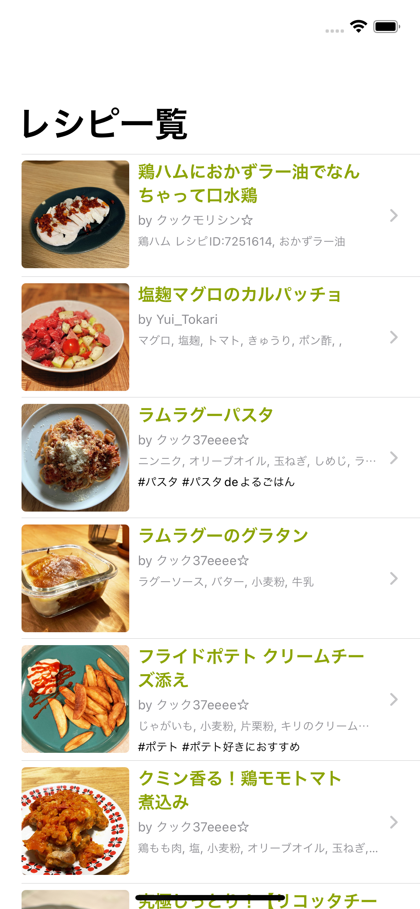
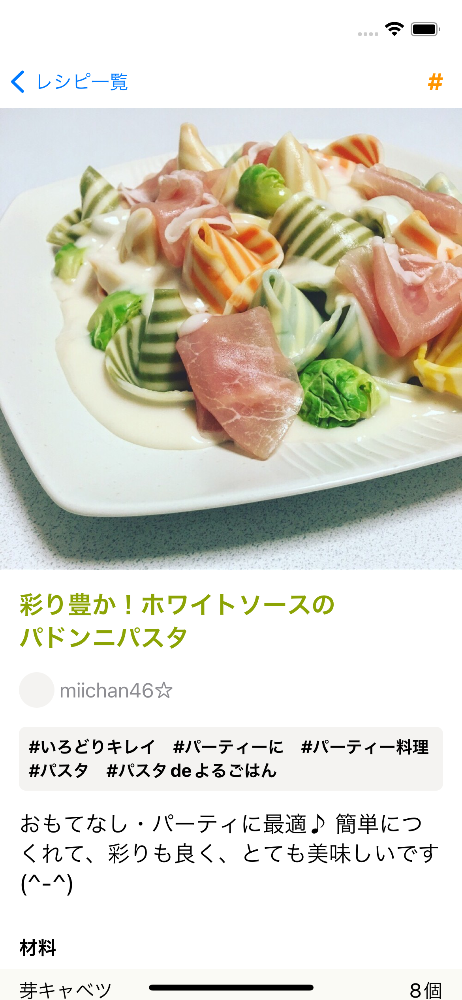
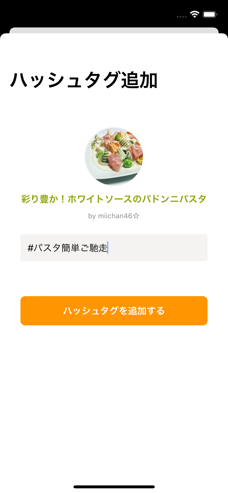

# MiniCookpad

## 内容

以下の 3 画面からなるレシピサービス「MiniCookpad」の iOS アプリ

| レシピ一覧画面                                   | レシピ詳細画面                                     | ハッシュタグ追加画面                                     |
| ------------------------------------------------ | -------------------------------------------------- | -------------------------------------------------------- |
|  |  |  |

## 機能

- レシピ一覧画面
  - レシピの一覧がリスト表示される
  - レシピをタップすると、レシピ詳細画面へ遷移
- レシピ詳細画面
  - レシピの詳細情報が表示される
  - 「#」ボタンをタップすると、ハッシュタグ追加画面へ遷移
- ハッシュタグ追加画面
  - レシピに紐付くハッシュタグを追加することができる

## 技術仕様

- UI は SwiftUI で構築し、必要がなければ UIKit は用いない
- 以下の 2 つの API エンドポイントから必要なデータを取得する
  - ハッシュタグ以外のレシピ情報: `http://localhost:3001`
    - [GET] `/recipes`
      - レシピのリストを取得する
      - クエリパラメータ
        - `limit`: Optional
          - 取得するレシピの件数の上限を指定する
          - 例: `limit=10` (レシピを最大 10 件取得する)
      - サンプルレスポンス
        - [MiniCookpad/Networking/Stub/Fixture/get_recipe_list.json](../MiniCookpad/Networking/Stub/Fixture/get_recipe_list.json)
    - [GET] `/recipes/:recipe_id`
      - レシピの詳細情報を取得する
      - クエリパラメータ
        - なし
      - サンプルレスポンス
        - [MiniCookpad/Networking/Stub/Fixture/get_recipe_detail.json](../MiniCookpad/Networking/Stub/Fixture/get_recipe_detail.json)
  - レシピに紐付くハッシュタグ: `http://localhost:3002`
    - [GET] `/recipe_hashtags`
      - レシピに紐付くハッシュタグを取得する
      - クエリパラメータ
        - `hashtag_limit_per_recipe`: Optional
          - 取得するハッシュタグの件数の上限を指定する
          - 例: `hashtag_limit_per_recipe=10` (ハッシュタグを最大 10 件取得する)
        - `recipe_ids`: Required
          - ハッシュタグを取得するレシピの ID をカンマ区切りで指定する
          - 例: `recipe_ids=1,2,3,4,5,6,7,8,9,10` (レシピ ID 1〜10 のハッシュタグを取得する)
      - サンプルレスポンス
        - [MiniCookpad/Networking/Stub/Fixture/get_recipe_list_hashtags.json](../MiniCookpad/Networking/Stub/Fixture/get_recipe_list_hashtags.json)
    - [POST] `/hashtags`
      - レシピにハッシュタグを追加する
      - リクエストボディ
        - `recipe_id`: Required
          - ハッシュタグを追加するレシピの ID
        - `value`: Required
          - スペース区切りのハッシュタグの文字列
          - 例: `#平日のお昼に #リピート決定`
      - curl でのリクエスト例
        - `$ curl -X POST -H "Content-Type: application/json" -d '{"recipe_id": 4961134, "value": "#平日のお昼に #リピート決定"}' http://localhost:3002/hashtags`
      - サンプルレスポンス
        - [MiniCookpad/Networking/Stub/Fixture/post_recipe_hashtags.json](../MiniCookpad/Networking/Stub/Fixture/post_recipe_hashtags.json)
